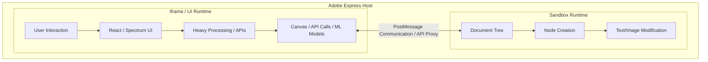

# Adobe Express Add-ons

A collection of custom add-ons built for Adobe Express to extend its capabilities with advanced image processing, automated text transliteration, and AI-driven brand design assistance.

These add-ons are built using the Adobe Express Add-on SDK and run directly within the Express editor using its dual-runtime architecture.

---

## Table of Contents
1. [PhotoLabs (Advanced Image Processing)](#photolabs---advanced-image-processing)
2. [Romanizer & Ruby (Text Localization)](#romanizer--ruby---text-localization)
3. [Pixel Pluck (AI-Powered Design Assistant)](#pixel-pluck---ai-powered-design-assistant)
4. [Technical Architecture](#technical-architecture)
5. [Marketplace & Installation Links](#marketplace--installation-links)

---

## PhotoLabs - Advanced Image Processing

PhotoLabs is an image processing add-on that provides tools for channel manipulation, color space splitting, halftone prints, and glitch effects directly within the Adobe Express workspace.

* **Repository:** [Keshav-poha/Photolab](https://github.com/Keshav-poha/Photolab)
* **Marketplace Status:** [Install Link](#marketplace--installation-links)

### Key Features

* **Channel Splitter:**
  * **RGB Extraction:** Isolates individual Red, Green, or Blue channels as precise grayscale maps.
  * **CMY Extraction:** Translates RGB data to Cyan, Magenta, or Yellow using mathematical formulas:
    * $C = 1 - (R/255)$
    * $M = 1 - (G/255)$
    * $Y = 1 - (B/255)$
  * **HSL Extraction:** Extracts Saturation or Lightness parameters for advanced masking.
* **Glitch Effects:**
  * **Chromatic Aberration:** Creates physical offsets for Red and Blue channels with independent X/Y sliders (-50px to +50px) and real-time previews.
  * **Channel Jitter:** Applies customizable random noise to individual RGB channels with adjustable intensity (0–255) for retro digital noise effects.
* **Halftone Print Engine:**
  * Translates images into halftone dot patterns by dividing the canvas into $N \times N$ pixel blocks.
  * Renders procedural vector circles with radii mathematically mapped to block brightness (adjustable dot sizing from 3px to 20px).
* **Image Utilities:**
  * **Luma Keying:** Real-time background removal using an adjustable luminance threshold.
    * *Formula:* If $(0.299R + 0.587G + 0.114B) < \text{Threshold}$, set $Alpha = 0$.
  * **Channel Inverter:** Invert individual Red, Green, or Blue channels independently.

### Tech Stack
* **Language:** TypeScript
* **User Interface:** Adobe Spectrum Web Components (for a native Adobe look and feel)
* **Processing:** Canvas API & `Uint8ClampedArray` (for real-time pixel data manipulation)
* **Runtime:** Dual-Runtime Architecture (UI + Document Sandbox via Adobe Express Document SDK)

---

## Romanizer & Ruby - Text Localization

Romanizer & Ruby is a text localization add-on that handles real-time script transliteration, language translation, and automated positioning of phonetic Ruby annotations (furigana/pinyin/indic guides) above text elements.

* **Repository:** [Keshav-poha/romanizer-ruby](https://github.com/Keshav-poha/romanizer-ruby)
* **Marketplace Status:** [Install Link](#marketplace--installation-links)

### Key Features

* **Transliteration Engine:**
  * **Universal Script Support:** Converts complex characters (Kanji, Hangul, Cyrillic) and Indic scripts to Romanized pronunciations.
  * **Keyless & Localized:** Utilizes lightweight, dictionary-free API endpoints for seamless, zero-config real-time processing.
  * **Auto-Language Detection:** Instantly identifies language family, dialect, and parsing confidence on the fly.
* **Script Translation Pipeline:**
  * Enables a "Translate-then-Romanize" pipeline (e.g., Translate English text to Japanese first, then automatically overlay the transliterated Romanized guides).
* **Native Ruby Annotations:**
  * Generates and positions phonetic guide text perfectly above the parent text box.
  * **Style Inheritance:** Automatically clones the exact typographic properties of the parent text (font-family, baseline, kerning, underline, color).
  * **Dynamic Constraints:** Renders the Ruby annotations at exactly 40% of parent font-size, keeping the layouts responsive, while auto-cloning precise rotations via `setRotationInParent`.

### Tech Stack
* **Language:** TypeScript
* **User Interface:** Adobe Spectrum Web Components
* **Integrations:** Public dictionary-free script transliteration endpoints & translation APIs
* **Runtime:** Document Sandbox text parsing and multi-layer text-node creation/grouping.

---

## Pixel Pluck - AI-Powered Design Assistant

Pixel Pluck was developed during the Adobe Express Add-ons for Enterprise Hackathon at NSUT. It is an AI-powered design assistant that helps designers maintain brand compliance, generate relevant design ideas, and audit layouts directly on the canvas.

* **Repository:** [Keshav-poha/Pixel-Pluck](https://github.com/Keshav-poha/Pixel-Pluck)
* **Marketplace Status:** [Install Link](#marketplace--installation-links)

### Key Features

* **Brand Identity Extraction:**
  * Powered by advanced Vision-Language Models (VLMs). Designers upload website screenshots or feed landing page parameters, and the AI extracts a comprehensive brand kit, including color palettes (HEX codes), typography styles, brand voice, and guidelines.
* **Firefly Prompt Generator:**
  * Generates rich, highly descriptive prompt parameters engineered specifically for the Adobe Firefly generative model, assuring the generated assets remain consistent with the extracted brand kit.
* **Viral Trends Discovery:**
  * Suggests trending, seasonal, and culture-specific campaign ideas that leverage the brand's identity, ensuring marketing designs remain fresh and relevant.
* **AI Design Audit & Feedback:**
  * Audits active designs, checking typography coherence, visual hierarchy, layout quality, color contrast, and accessibility (WCAG compliance) to score design quality out of 100 with optimization feedback.
* **Content Moderation:**
  * Integrated safety layer checking all generated prompts and responses to ensure full compliance with enterprise safety and toxicity guidelines.

### Tech Stack
* **UI Framework:** React + Vite (for high-speed rendering)
* **AI Models:** Meta Llama 3.3 70B Versatile (for textual analysis) & Meta Llama 4 Maverick (for vision-guided analysis) via the high-throughput Groq API.
* **Runtime:** Adobe Express Document Sandbox & Iframe UI integration
* **Localization:** Multilingual support (English, Spanish, French)

---

## Technical Architecture

Each add-on in this ecosystem utilizes the robust Adobe Express Dual-Runtime Model to guarantee performance, visual integration, and security.

### Architecture Benefits
1. **Performance Separation:** Heavy network requests, UI renderings, Canvas calculations, or AI calls run inside the **UI Runtime**, leaving the design canvas completely lag-free.
2. **Secure Operations:** The **Document Sandbox** operates with direct access to the `express-document-sdk`, ensuring controlled, safe, and precise manipulations of text nodes, layers, and bitmaps.

---

## Marketplace & Installation Links

Below is the directory for the official Adobe Express Marketplace links for each add-on.

| Add-on Name | Marketplace Installation Link | Developer | Source Code |
| :--- | :--- | :--- | :--- |
| **PhotoLabs** | 📥 [Install on Adobe Express Marketplace](https://express.adobe.com/sp/addons) *(Link coming soon!)* | [Keshav Kumar](https://github.com/Keshav-poha) | [GitHub Repository](https://github.com/Keshav-poha/Photolab) |
| **Romanizer & Ruby** | 📥 [Install on Adobe Express Marketplace](https://express.adobe.com/sp/addons) *(Link coming soon!)* | [Keshav Kumar](https://github.com/Keshav-poha) | [GitHub Repository](https://github.com/Keshav-poha/romanizer-ruby) |
| **Pixel Pluck** | 📥 [Install on Adobe Express Marketplace](https://express.adobe.com/sp/addons) *(Link coming soon!)* | [Keshav Kumar](https://github.com/Keshav-poha) | [GitHub Repository](https://github.com/Keshav-poha/Pixel-Pluck) |

---

*Developed by [Keshav Kumar](https://github.com/Keshav-poha) and team.*
